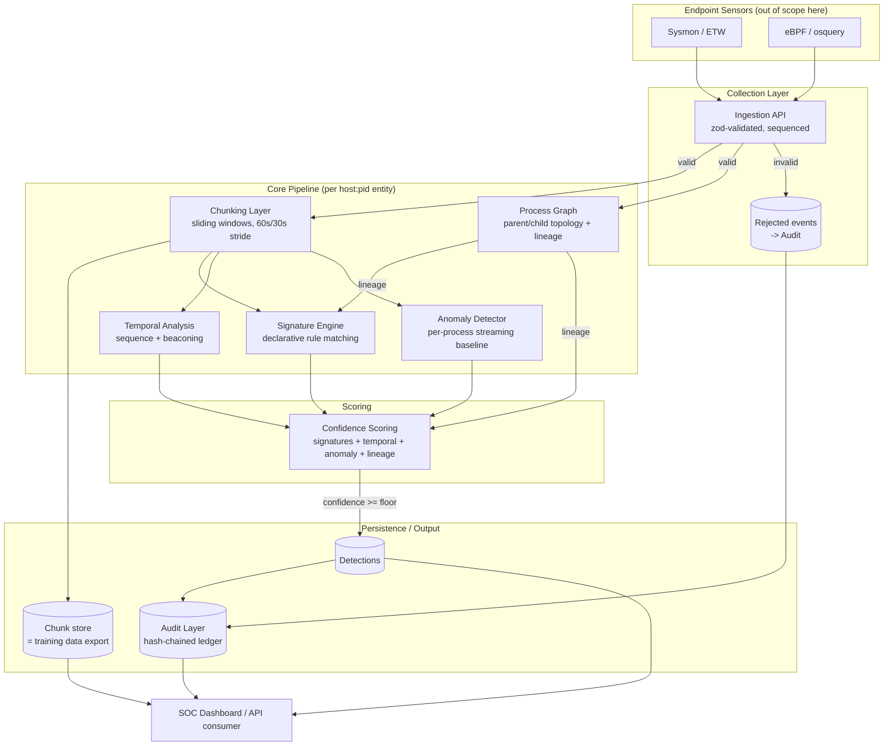

# EDR Behavior Explorer — Collection & Detection Engine

A reference, production-shaped implementation of the behavioral detection
pipeline behind an enterprise EDR's process explorer: collection → windowed
chunking → signatures → temporal analysis → process graph → anomaly
detection → confidence scoring → tamper-evident audit log.

Everything runs in-process with no external infra, but every module is
written against the same contract you'd use with real infra — see
"Swapping in real infrastructure" below.

## Topology



**Why this shape:**
- **Collection is the trust boundary.** Nothing downstream ever sees an
  unvalidated event; malformed telemetry is rejected *and* recorded (sensor
  drift / tampering is itself a signal), never silently dropped.
- **Chunking and the Process Graph are siblings, not a chain.** Both consume
  the same normalized event stream independently — the graph needs the full
  parent/child history regardless of windowing, while chunks are bounded
  windows for feature extraction.
- **Three independent detectors feed one fuser.** Signatures (deterministic,
  explainable), temporal analysis (sequence/periodicity), and anomaly
  detection (statistical, adaptive) each see the same chunk but know nothing
  about each other. This is what makes the system extensible — replacing
  the anomaly detector with a trained model means changing one module's
  internals, not the pipeline.
- **The audit log is downstream of everything, including its own
  failures.** Detections, suppressed duplicates, rejected events, and
  pipeline errors all land in the same hash-chained ledger so a forensic
  review has one place to look.

## Layer-by-layer

| Layer | File | What it does |
|---|---|---|
| Collection | `src/collection/CollectionLayer.ts` | Zod-validates raw events, assigns sequence numbers, flags clock skew, emits `event`/`rejected` |
| Chunking | `src/chunking/ChunkingLayer.ts` | Per-entity sliding windows (default 60s window / 30s stride) → `BehaviorChunk` with a flat `ChunkFeatures` vector |
| Process Graph | `src/graph/ProcessGraph.ts` | Per-host parent/child topology; ancestry lineage, descendant traversal, full-graph snapshot for a dashboard |
| Signatures | `src/signatures/SignatureEngine.ts` | 6 declarative rules (office→shell, encoded cmdline, LOLBin chains, mass file write, credential access, nested-shell lineage) |
| Temporal | `src/temporal/TemporalAnalysis.ts` | Ordered event-sequence matching with a max time-gap, plus beaconing detection via coefficient-of-variation on connection intervals |
| Anomaly | `src/anomaly/AnomalyDetector.ts` | Per-process-name streaming baseline (Welford's algorithm — no stored history), z-score deviation, with explicit handling for zero-variance baselines |
| Scoring | `src/scoring/ConfidenceScoring.ts` | Weighted fusion of all four signal sources into a 0–100 confidence + severity bucket |
| Audit | `src/audit/AuditLayer.ts` | Append-only, SHA-256 hash-chained ledger; `verifyChain()` detects any retroactive tampering |
| Pipeline | `src/pipeline.ts` | Wires every layer together; the only file that knows about all of them |
| API | `src/api/server.ts` | Fastify HTTP surface: ingest, query detections/graph/chunks, verify audit |

## Quick start

```bash
npm install
npm run demo     # runs a simulated attack chain + benign baseline end-to-end, prints results
npm run build && npm start   # real HTTP server on :8787
```

The server runs a periodic wall-clock sweep (`EDR_AUTOFLUSH_MS`, default 15000)
that force-closes any window whose entity has gone quiet. Without this, a
window only closes when a *new* event arrives for that same entity — meaning
a process that does something malicious and then exits or goes idle would
never cross the detection floor. This was found and fixed while integrating
the frontend against the real HTTP API rather than the in-process demo.

### API surface

| Endpoint | Purpose |
|---|---|
| `POST /events` | Ingest one event or an array of events |
| `GET /detections?hostId=&minConfidence=` | Query detections |
| `GET /graph/:hostId` | Process graph snapshot (nodes + edges) for a host |
| `GET /chunks?entityId=&format=features` | Training-data export — every closed chunk, optionally flattened |
| `GET /audit/verify` | `{ valid, brokenAtIndex }` — walks the hash chain |
| `GET /audit/tail?n=20` | Recent audit entries |

## What the demo proves

`npm run demo` replays a single host's telemetry:
1. **10 benign `svchost.exe` instances** to build a real statistical baseline.
2. **1 anomalous `svchost.exe` instance** (12x connections, 18 file writes,
   all to a feature that was previously *always exactly 1*) — caught purely
   by the anomaly detector, no signature involved.
3. **`explorer.exe → winword.exe → cmd.exe → powershell.exe`**, encoded
   command line, regular 10s-interval beaconing, a dropper write, an LSASS
   touch, and 30 file writes — trips 4 signatures, 2 temporal findings, and
   lineage risk simultaneously, landing at confidence 100 / critical.
4. **`rundll32.exe → cmd.exe`** — a LOLBin-chain signature on its own.
5. **One deliberately malformed event** — proves rejected telemetry is
   captured in the audit trail, not silently dropped.
6. A live tampering demonstration: mutating one audit entry's payload
   in place and re-running `verifyChain()` to show the break is detected.

## Known production trade-offs (by design, documented rather than hidden)

- **Overlapping windows can yield two detections with overlapping but not
  identical evidence** for one fast-moving entity (a 60s/30s sliding window
  will see the same burst from two angles). Exact-duplicate fingerprints
  *are* suppressed (`lastDetectionFingerprint` in `pipeline.ts`); windows
  with genuinely different evidence are not, since collapsing them risks
  hiding a real escalation between windows. A SOC dashboard would group by
  `entityId` and treat near-duplicate detections within one stride as a
  single incident thread, not collapse them at the engine layer.
- **Anomaly baselines are keyed by process name, not by host+pid.** This is
  intentional — "normal for `powershell.exe`" is a population statistic,
  not a per-instance one — but it means a fleet-wide compromise of many
  instances of the same process simultaneously could shift the baseline
  itself. Production systems typically run a slower-moving "trusted"
  baseline alongside the live one for exactly this reason.
- **The signature engine is intentionally rule-based and explainable**
  rather than ML-based. The chunk feature vectors it shares with the
  anomaly detector are the same artifact you'd export to train a model —
  see `GET /chunks?format=features` — so the two approaches are meant to
  run side by side, not be sequentially replaced.

## Swapping in real infrastructure

| Here | In production |
|---|---|
| In-memory `EventEmitter` (Collection→Pipeline) | Kafka / Kinesis |
| In-memory chunk/detection arrays | ClickHouse / TimescaleDB (chunks), Postgres (detections) |
| In-memory `AuditLayer` array | Append-only object storage (S3 Object Lock) or a dedicated ledger service |
| In-memory `ProcessGraph` per host | Graph database (Neo4j) once host counts get large, or partition by host in a KV store |
| Rule-based `AnomalyDetector` | Same `ChunkFeatures` vectors feeding a trained model (isolation forest / autoencoder); keep this rule-based version as a fast first-pass filter |
